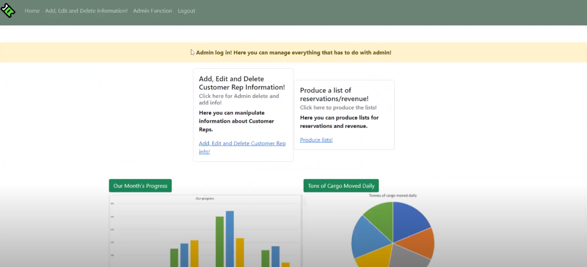

# 🚄 Railway Navigator
Railways Navigator is a platform to plan, order, and view recent train station in New Jersey. 
Using a relational database model, RailwayNavigator
is able to aggregate and query information for an individual user that 
registers for the platform.

## Preview 

  

## Contributors
Created Fall 2020 - CS336 @ Rutgers University
+ Joel Martinez
+ Axel Jimenez-Riano
+ Quan Hoang
+ Ernesto Heras

## Server Side and Database 
In this project we used MySQL, Apache Tomcat, AWS EC2 and AWS RDS for the 
server side database and web page connections. 

+ MySQL client to host our database
+ AWS EC2 to host our web page
+ AWS RDS to host our database 

## Content

The source folder `NewJerseyRailway/` contains 
all the jsp files created for the entirety of the project.
This project uses JSP as a collection of  technologies. Otherwise, this project
uses vanilla Java, HTML, and CSS for the entire web application. Insert your database admin and password
credentials as necessary.

### Academic Integrity
Since this project was done in a group for CS336 it is important to keep 
the information below in mind.
1. Don't cheat. It's not worth it and you learn nothing.
2. You're cheating yourself out of learning what Databases are.
3. Please follow Rutgers' Academic Integrity policy
> Policy: https://www.cs.rutgers.edu/academics/undergraduate/academic-integrity-policy
